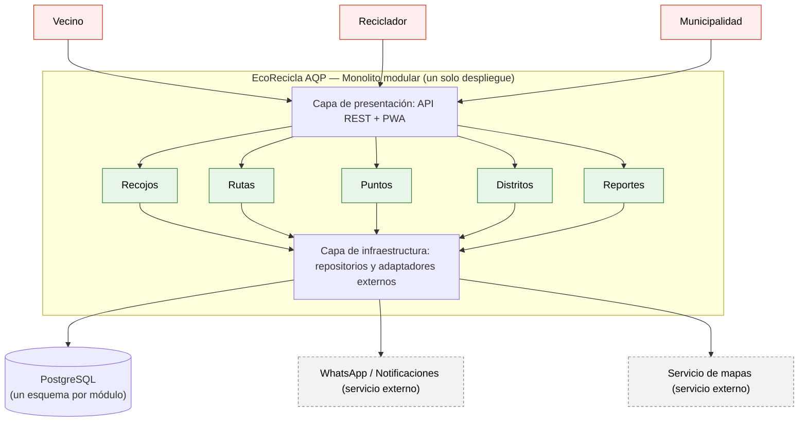

# EcoRecicla AQP — Laboratorio 04: Fundamentos de arquitectura de software
Construcción de Software · EPIS-UNSA · 2026-B · Grupo 11

## Integrantes
| Nombre | Rol en el laboratorio |
|--------|-----------------------|
| Daniela Choquecondo Aspilcueta | Redacción de drivers, matriz de decisión, ADR y diagramas; gestión del repositorio y uso de IA |
| Daniel Bedregal Perez | Revisión y aprobación de Pull Requests; verificación de la bitácora de IA y de los diagramas |

## Caso
EcoRecicla AQP es una plataforma web (PWA) para el recojo de residuos reciclables con recicladores formalizados en distritos de Arequipa. Los vecinos solicitan recojos y acumulan puntos canjeables, los recicladores consultan su ruta del día y confirman el recojo con el peso, y la municipalidad configura distritos y reglas de puntos y consulta reportes de toneladas recicladas. El atributo de calidad crítico es la **modificabilidad**: incorporar un nuevo distrito o una nueva regla de puntos en ≤ 2 días-persona, sin modificar los demás módulos.

## Arquitectura elegida
Monolito modular (puntaje 4,10 en la [matriz de decisión](docs/architecture/matriz-decision.md)).

## Documentación
- [Drivers y escenarios de calidad](docs/architecture/drivers.md)
- [Matriz de decisión](docs/architecture/matriz-decision.md)
- [Bitácora de uso de IA](docs/architecture/bitacora-ia.md)
- Diagramas: [Mermaid](docs/architecture/diagramas/arquitectura.mmd), [PlantUML (alternativa descartada)](docs/architecture/diagramas/alternativa.puml) y [vista de despliegue](docs/architecture/diagramas/despliegue.py)

## Decisiones arquitectónicas
- [ADR-001: Estilo arquitectónico (monolito modular)](docs/architecture/adr/001-estilo-arquitectonico.md)
- [ADR-002: Base de datos (PostgreSQL)](docs/architecture/adr/002-base-de-datos.md)
- [ADR-003: PWA con sincronización offline](docs/architecture/adr/003-pwa-offline.md)

## Reflexión sobre el uso de la IA
La IA nos ayudó a generar rápido las alternativas de arquitectura, los borradores de los documentos y el código de los diagramas, y a ver riesgos que no habíamos considerado, como la sincronización sin conexión. Pero cometió errores que tuvimos que detectar: la matriz entregó totales que no coincidían con el cálculo de pesos por puntajes, el primer código de PlantUML se dibujó sin ningún texto, y el script de despliegue usaba Django aunque nuestra restricción solo menciona Python. También nos sirvió para comprobar que una recomendación no se acepta sin verificarla. Verificamos en fuentes oficiales que import-linter controla importaciones entre módulos y que la Ley 29733 protege los datos personales. Aprendimos a recalcular a mano, a validar cada diagrama en su editor y a contrastar las propuestas de la IA con nuestras restricciones reales de plazo, equipo y presupuesto.
